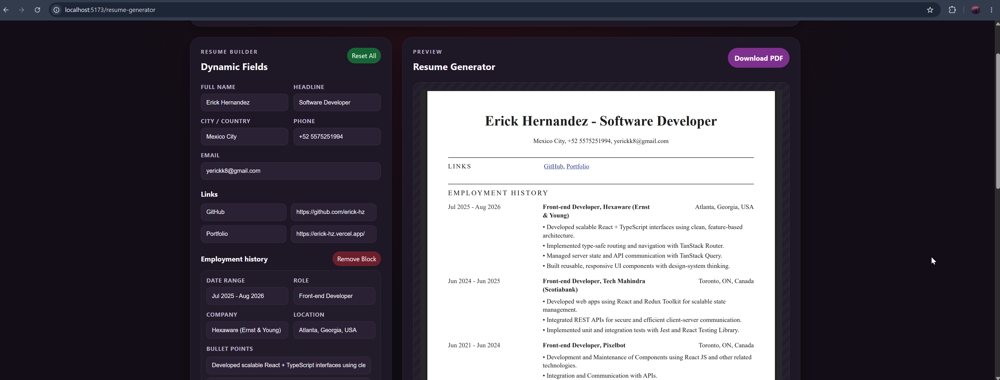

# React TSX App

A React + TypeScript + Vite application featuring a Pokédex, public API explorer, and a free, client-side resume generator built with React PDF.

Fuck Resume.io.

Scammers, this is a free tool.


## Preview



## Stack

| Technology              | Purpose                                         |
| ----------------------- | ----------------------------------------------- |
| React 19                | UI framework                                    |
| TypeScript              | Type safety                                     |
| Vite                    | Build tooling                                   |
| TanStack Router         | File-based routing with type-safe search params |
| TanStack Query          | Server state management with persistence        |
| i18next + react-i18next | Internationalization (EN, ES, JA)               |
| @react-pdf/renderer     | Client-side PDF generation                      |
| ESLint                  | Static analysis                                 |

## Requirements

- Node.js 20+
- npm 10+

## Quick Start

```bash
npm install
npm run dev
```

App URL: http://localhost:5173

## Scripts

- `npm run dev` — start development server
- `npm run build` — production build
- `npm run preview` — preview build
- `npm run test` — run test suite once
- `npm run test:watch` — run tests in watch mode
- `npm run test:coverage` — run tests with coverage report
- `npm run lint` — run ESLint
- `npm run lint:fix` — run ESLint with auto-fixes
- `npm run format` — format files with Prettier
- `npm run format:check` — verify formatting without changing files

## Project Structure

```text
src/
├── app/                    # App entry, router config, and global styles
│   ├── providers/          # App-level providers (prefetch, query client)
│   ├── routes/             # Route components and route-specific logic
│   └── styles/             # Global CSS
├── features/               # Self-contained feature modules
│   ├── language-switcher/
│   ├── pokemon/            # API, query keys, types, and UI
│   ├── public-apis/        # API, query keys, types, and UI
│   └── theme-toggle/
└── shared/                 # Cross-feature utilities and components
    ├── config/             # i18n setup
    ├── locales/            # Translation files (EN, ES, JA)
    ├── logging/            # HTTP client and logger
    └── ui/                 # Reusable UI components
```

## Resume Generator

A free, client-side resume builder available at `/resume-generator`. No accounts, no subscriptions — generate and download a PDF directly in the browser.

**Supported sections:** Header · Links · Employment History · Skills · Languages · Hobbies · Education

**Implementation notes:**

- Form state is managed in a dedicated hook (`useResumeGeneratorModel`)
- PDF preview and template are componentized under `src/app/routes/resume-generator/`
- Live preview and download use the same React PDF template

## TanStack Router Conventions

- Route registration is centralized in `src/app/router.tsx`.
- Search params are validated through dedicated validators in `src/app/routes/searchValidators.ts`.
- Route pages should consume validated search state and avoid reading raw URL params directly.
- New routes that depend on search params should include validator tests.

## TanStack Query Conventions

- Query keys are defined by feature modules and must include only dimensions that affect fetched data.
- Global query defaults are configured in `src/app/main.tsx`.
- Query cache is persisted in localStorage through `PersistQueryClientProvider`.
- Current defaults:
  - `staleTime`: 5 minutes for core pokemon queries
  - `gcTime`: 30 minutes for core pokemon queries
  - `retry`: 1
  - `refetchOnWindowFocus`: false
- Feature-level prefetching runs in `src/app/providers/AppPrefetch.tsx`.
- UI components should always account for loading, empty, success, and error states when consuming queries.

## Quality Gates

- Required before opening a PR: `npm run lint`, `npm run test`, `npm run build`.
- Pre-commit formats staged files through lint-staged.
- Review standards are defined in `.github/REVIEW_BEST_PRACTICES.md`.

## Contributing

Open a PR using the template at [docs/PULL_REQUEST_TEMPLATE.md](docs/PULL_REQUEST_TEMPLATE.md). Complete all checklist items and pass the quality gates before requesting review.

For style consistency:

- Use the recommended VS Code extensions from `.vscode/extensions.json`
- Keep `editor.formatOnSave` enabled
- Run `npm run format:check` before opening a PR

## External APIs

| API                                                                   | Usage            |
| --------------------------------------------------------------------- | ---------------- |
| [PokéAPI](https://pokeapi.co/)                                        | Pokémon data     |
| [GitHub API](https://api.github.com/repos/erick-hz/pokedex-react-tsx) | Repository stats |

## License

MIT © 2026 [Erick Hz](https://github.com/erick-hz)
